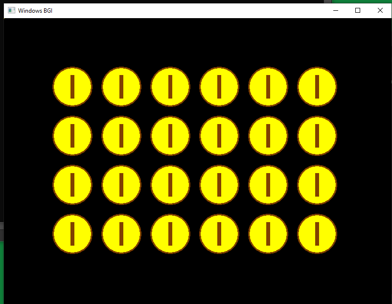

# Coin animation
## Created using C++ and the graphics.h library.

Compiled in Code::Blocks IDE.

By changing the value `delay(300);` you can make the appearance of coins instantaneous or vice versa one after another.

